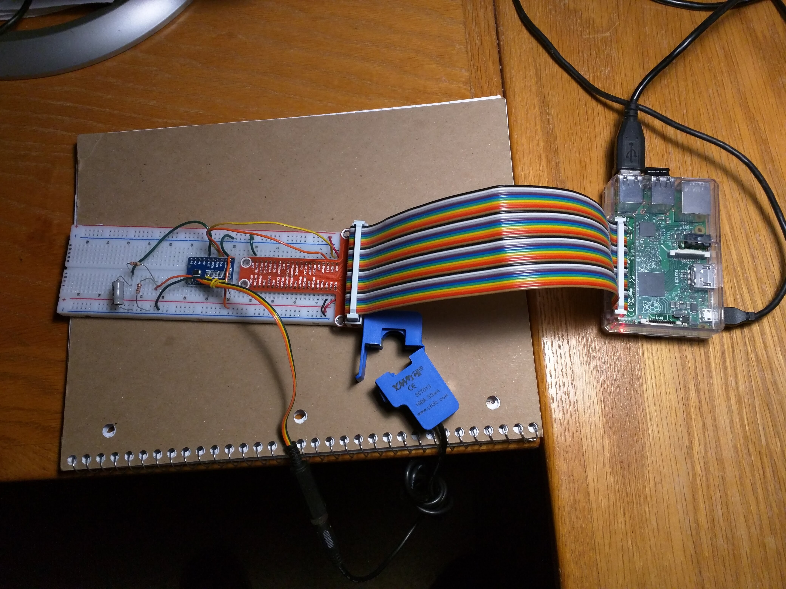

##Monitoring Energy with your Raspberry Pi

The centerpiece of the design is an ADC1115 analog-to-digital controller, which used I2C to communicate with the RPi.

The software consists of two scripts that should run continuously on your RPi and that you probably want to start automatically from /etc/rc.local or through another way.

1. logger.py: A python script that reads out the current sensors and saves the reading data to a local database on the RPi
2. uploader.py: A python script that uploads the reading data to a remote MySQL DB and cleans up the local DB

##Prerequisites

A Raspberry Pi.  I did my development on a Raspberry Pi Model 3B+. Should work on other RPi's as well.

- Python 3 - This is probably already installed.  If not, use sudo apt-get install python3 
- SQLite 3 - Install this using sudo apt-get install sqlite3 
- ADS1115 module - sudo pip3 install <TODO>
- MySQL module - sudo pip3 install <TODO>

##Configuration
Configuration is stored in the config.json file. There is a section for every python script.

- Reader
  - Voltage: average voltage of the measured installation
  - Substractor: the value the sensors pick up when no current is flowing. This corrects hardware offsets. Can be positive or negative.
  - AmpFactor:  depending on the type of sensors, resistors you use, a different multiplication needs to be done to go from the read value to the actual Amps. The right value for your implementation should be determined by testing.
  - Gain: ADS1115 Gain value
  - DataRate: ADS1115 Data rate value
  - ReadTime: Time in seconds you want to read the sine wave from the sensor
- Logger
  - Database: Location of the local SQLite DB
  - LogInterval: A record per channel per x seconds is created in the ReadingData table
- Uploader
  - Host: Location of the remote MySQL DB
  - Port: Port of the remote MySQL DB
  - Database: DB Name of the remote MySQL DB
  - User: Credentials to connect to the remote MySQL DB
  - Password: Credentials to connect to the remote MySQL DB
  - UploadInterval: Time in seconds to check for records in the local DB to upload.
  - LocalDataKeepDays: Number of days of data you want to keep in the local DB before erasing it.

##logger.py

<TODO>
  
##uploader.py

<TODO>
